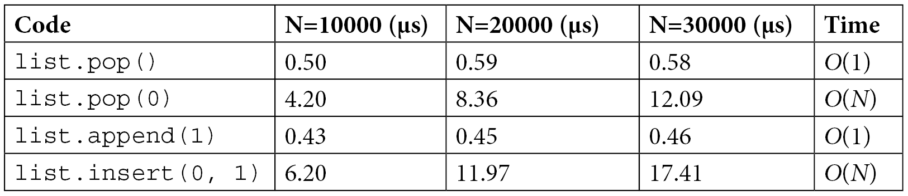
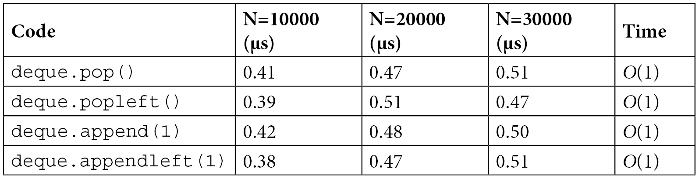
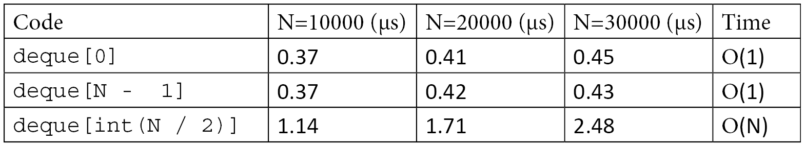
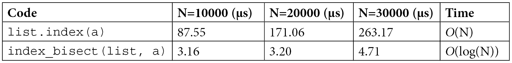

# 纯 Python 优化

提高应用程序性能的最有效方法之一是使用更好的算法和数据结构。

涵盖的主题列表如下：

- 使用正确的算法和数据结构
- 通过缓存和记忆提高效率
- 使用生成式和生成器进行高效迭代

## 使用正确的算法和数据结构

算法改进对于提高性能特别有效，因为它们通常允许应用程序随着越来越大的输入而更好地扩展。

算法运行时间可以根据其计算复杂性进行分类，计算复杂性是执行任务所需资源的特征。

这种分类通过 Big O 符号表示，即执行任务所需操作的上限，通常取决于输入大小。具体来说，Big O 符号描述了算法的
运行时间或内存需求如何随输入大小而增长。因此，较低的 Big O 表示更高效的算法，这正是我们的目标。

如果操作不依赖于输入的大小（例如，访问列表的第一个元素），则该算法的时间称为常数或 O(1)。这意味着，无论我们有多少数据，运行算法的时间总是相同的。

如果我们将输入数组的大小加倍，并且操作次数将成比例增加。由于操作次数与输入大小成正比，因此该算法的时间为 O(N)，其中 N 是输入数组的大小。

在某些情况下，运行时间可能取决于输入的结构（例如，如果集合已排序或包含许多重复项）。在这些情况下，算法可能具有不同的最佳情况、平均情况和最坏情况运行时间。除非另有说明，否则给出的运行时间均视为平均运行时间。

### 列表和双端队列

Python 列表是元素的有序集合，在 Python 中以可调整大小的数组实现。数组是一种基本数据结构，由一系列连续的内存位置组成，每个位置都包含对 Python 对象的引用。

列表在访问、修改和追加元素方面表现出色。访问或修改元素涉及从底层数组的适当位置获取对象引用，并且具有 O(1) 复杂度。追加元素也非常快。创建空列表时，会分配一个固定大小的数组，并且随着我们插入元素，数组中的插槽会逐渐填满。一旦所有插槽都被占用，列表就需要增加其底层数组的大小，从而触发内存重新分配，这可能需要 O(N) 时间。然而，这些内存分配并不频繁，追加操作的时间复杂度称为摊销 O(1) 时间。

可能存在效率问题的列表操作是在列表开头（或中间某处）添加或删除元素的操作。当从列表开头插入或删除一个项目时，数组的所有后续元素都需要移动一个位置，因此需要花费 O(N) 时间。

可以看到，如果在列表的开头或结尾执行插入和删除操作，性能会有很大的差异：



在某些情况下，需要在集合的开头和结尾高效地插入或删除元素。Python 在 `collections.deque` 类中提供了具有这些属性的数据结构。deque 一词代表双端队列，因为此数据结构旨在高效地在集合的开头和结尾放置和删除元素，就像队列的情况一样。在 Python 中，deque 实现为双向链表。

`Deques` 除了 `pop` 和 `append` 之外，还具有 `popleft` 和 `appendleft` 运行时间 O(1) 的方法：



尽管有这些优点，但大多数情况下不应使用双端队列来替代常规列表。通过 `appendleft` 和 `popleft` 操作获得的效率是有代价的——访问双端队列中间的元素是一个
O(N) 操作，如下表所示：



在列表中查找项目通常需要 O(N) 操作，并使用 `list.index` 方法执行。加快列表中查找速度的一种简单方法是保持数组排序，然后使用 `bisect` 模块执行二分查找。

`bisect` 模块允许对排序数组进行快速搜索。`bisect.bisect` 函数可用于排序列表，以查找放置元素的索引，同时保持数组的排序顺序。

```python
import bisect
collection = [1, 2, 4, 5, 6]
bisect.bisect(collection, 3)
```

此函数使用二进制搜索算法，其运行时间为 O(log(N))。这样的运行时间非常快，基本上意味着每次输入大小加倍时，运行时间都会增加一个常数。这意味着，例如，如果程序在 1000 大小的输入上运行需要1秒，那么它处理 2000 大小的输入需要 2 秒，处理 4000 大小的输入需要 3 秒，依此类推。如果你有 100 秒，理论上你可以处理 $10^{33}$ ($2^{100}$?) 大小的输入！

如果我们尝试插入的值已经存在于列表中，则 `bisect.bisect` 函数将返回已存在值之后的位置。因此，我们可以使用 `bisect.bisect_left` 变体，它以以下方式返回正确的索引。


