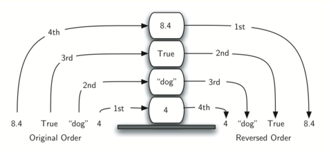

# 基本数据结构

## 何谓线性数据结构

栈、队列、双端队列和列表都是有序的数据集合，其元素的顺序取决于添加顺序或移除顺序。一旦某个元素被添加进来，它与前后元素的相对位置将保持不变。这样的数据集合经常被称为**线性数据结构**。

## 栈

### 何谓栈

栈有时也被称作“下推栈”。它是有序集合，添加操作和移除操作总发生在同一端，即“顶端”，另一端则被称为“底端”。

栈中的元素离底端越近，代表其在栈中的时间越长，因此栈的底端具有非常重要的意义。最新添加的元素将被最先移除。这种排序原则被称作 **LIFO**（last-in first-out），即后进先出。它提供了一种基于在集合中的时间来排序的方式。最近添加的元素靠近顶端，旧元素则靠近底端。

由于可用于反转元素的排列顺序，因此栈十分重要。

考虑到栈的反转特性，我们可以想到在使用计算机时的一些例子。例如，每一个浏览器都有返回按钮。当我们从一个网页跳转到另一个网页时，这些网页——实际上是 URL——都被存放在一个栈中。当前正在浏览的网页位于栈的顶端，最早浏览的网页则位于底端。如果点击返回按钮，便开始反向浏览这些网页。
