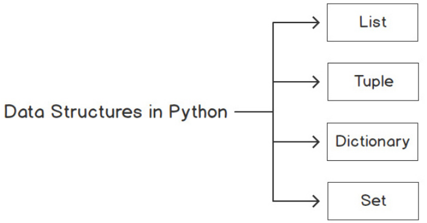

# Python Data Structures

## 介绍

在编程语言中，数据结构是指可以将一些数据保存在一起的对象，这意味着它们用于存储相关数据的集合。

Python 中有四种类型的数据结构：列表、元组、字典和集合：

## 列表的力量

列表是 Python 中的一种容器，用于同时存储多个数据集。Python 列表经常与其他编程语言中的数组进行比较，但它们的功能远不止于此。

Python 中的列表写在方括号 [ ] 内。列表中的每个元素都有自己唯一的索引。列表中的元素具有有限的序列。与其他编程语言一样，列表第一项的索引为 0，第二项的索引为 1，依此类推。

由于列表是 Python 中的一种可迭代类型，因此可以使用 for 循环来迭代列表内的所有元素。

> Python 列表与其他语言（如 Java 和 C#）中使用的数组不同。Python 允许列表中存在混合类型 ‑ 即 int 和 string。
>
## 列表方法

由于列表是一种序列类型，因此它支持所有序列操作和方法。

列表是最好的数据结构之一。Python 提供了一组列表方法，使我们可以轻松存储和检索值以维护、更新和提取数据。这些常见操作是 Python 程序员执行的，包括切片、排序、追加、搜索、插入和删除数据。

使用 `+` 运算符连接两个列表。

使用 `*` 运算符（可用于列表中的重复）来复制元素。

### 访问列表中的项

与其他编程语言一样，在 Python 中，可以使用 `index` 方法访问列表中的元素。

与字符串一样，Python 列表支持使用: 符号进行切片，格式为 `list[i:j]`，其中 i 是起始元素，j 是最后一个元素（不包括）。

### 将项添加到列表

列表非常强大，可用于许多情况。但是，通常不会事先知道用户想要存储的数据。在这里，将了解向列表添加项目和将项目插入列表的各种方法。

`append` 方法是将新元素添加到列表末尾的最简单方法。当在不知道元素总数的情况下构建列表时，通常会使用 `append` 方法。将从一个空列表开始，然后继续添加项目以构建列表。

`insert` 方法需要位置索引来指示新元素应放在哪里。位置索引是一个从零开始的数字，表示列表中的位置。

### 矩阵作为嵌套列表
