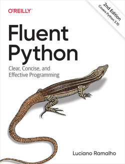

# Python-3

Read notes for Python book

## Status Table

<<<<<<< HEAD
| Title                                                                                      | Notes | Status    |
| ------------------------------------------------------------------------------------------ | ----- | --------- |
| [Fluent Python, 2nd](https://github.com/JPL-JUNO/Python-3/tree/main/FP-2nd)                | 😀     | reading 📑 |
| [Learning Python Programming, 3rd](https://github.com/JPL-JUNO/Python-3/tree/main/LPP-3rd) | 😀     | reading 📑 |
| [Mastering Python, 2nd](https://github.com/JPL-JUNO/Python-3/tree/main/MP-2nd)             | 😀     | reading 📑 |
=======
| Title                       | Folder                                                             | Status  | Edition | Language |
| --------------------------- | ------------------------------------------------------------------ | ------- | ------- | -------- |
| 流畅的 Python               | [FP-2nd](https://github.com/JPL-JUNO/Python-3/tree/main/FP-2nd)    | Reading | 2nd     | 简体中文 |
| Learning Python Programming | [LPP-3rd](https://github.com/JPL-JUNO/Python-3/tree/main/LPP-3rd)  | Reading | 3rd     | English  |
| Python 基础教程             | [BP-3rd](https://github.com/JPL-JUNO/Python-3/tree/main/BP-3rd)    | Reading | 3rd     | 简体中文 |
| Python Cookbook             | [PC-3rd-zh](https://github.com/JPL-JUNO/Python-3/tree/main/BP-3rd) | Reading | 3rd     | 简体中文 |
| Python3 标准库              | [PY3SL](https://github.com/JPL-JUNO/Python-3/tree/main/PY3SL)      | Reading | 1st     | 简体中文 |
>>>>>>> main

<!-- 

<<<<<<< HEAD

 
=======

 -->

## 下载链接

[Jython](https://www.jython.org/download)
[SWIG](https://www.swig.org/download.html)

## 安装命令

``$ java -jar jython-installer-2.7.3.jar``

Windows

SWIG直接解压，然后将该文件夹添加至环境变量

## 其他资源

[游戏图片](https://opengameart.org)

[Predicted Sunspot Number And Radio Flux Values](https://www.swpc.noaa.gov/products/predicted-sunspot-number-and-radio-flux)

<b>Fluent Python, 2nd</b>

>>>>>>> main
