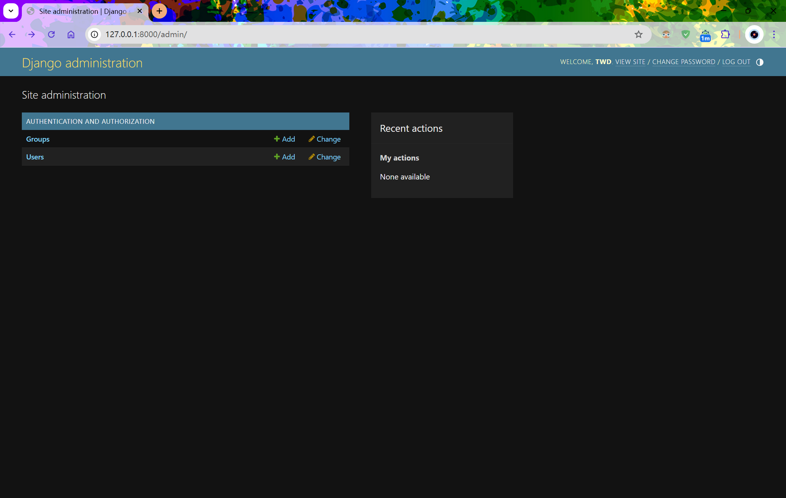

# 模型与数据库

说到数据库，你往往会想到结构化查询语言（Structured Query Language，SQL），这是从数据库中查询所需数据的常用工具。然而在 Django 中，查询底层数据库这项操作由对象关系映射器（Object Relational Mapper，ORM）负责。在 ORM 中，存储在一个数据库表中的数据封装为一个模型。模型则是描述数据库表中数据的 Python 对象。Django 不直接通过 SQL 查询数据库，而是使用相应的 Python 模型对象操纵。

## 创建模型

定义模型时，要指定字段及其类型，并提供必须或可选的参数。默认情况下，每个模型都有一个自增整数字段，名为 id。这个字段自动分配，用作主键。Django 内置的字段类型无所不包。下面介绍其中最常用的几个：

- `CharField`：存储字符数据（如字符串）的字段。`max_length` 参数指定最多可存储的字符数。
- `URLField`：类似于 `CharField`，不过是专用于存储 URL 的。也可指定 `max_length` 参数。
- `IntegerField`：存储整数。
- `DateField`：存储 Python `datetime.date` 对象。

每个字段都可指定 `unique` 参数，设为 `True` 时，字段的值在模型对应的底层数据库表中必须是唯一的。

此外，各字段还可指定其他参数，例如通过 `default='value'` 设定默认值，指定字段的值可以为空（`null=True`）或者不可以为空（`null=False`）。

为了建立模型之间的关系，Django 提供了三个字段类型，分别是：

- `ForeignKey`：用于建立一对多关系。
- `OneToOneField`：用于建立一对一关系。
- `ManyToManyField`：用于建立多对多关系。

## 创建和迁移数据库

Django 提供了迁移工具，让它帮助我们设置和更新数据库，体现模型的改动。例如，添加新字段后可以使用迁移工具更新数据库。

### 设置

首先，数据库必须预置，即创建数据库及相关的表。打开终端或命令提示符，进入项目的根目录（manage.py 文件所在的目录），执行下述命令。

>
> 输出内容可能不完全一样

```bash
$ python manage.py migrate
Operations to perform:
  Apply all migrations: admin, auth, contenttypes, sessions
Running migrations:
  Applying contenttypes.0001_initial... OK
  Applying auth.0001_initial... OK
  Applying admin.0001_initial... OK
  Applying admin.0002_logentry_remove_auto_add... OK
  Applying admin.0003_logentry_add_action_flag_choices... OK
  Applying contenttypes.0002_remove_content_type_name... OK
  Applying auth.0002_alter_permission_name_max_length... OK
  Applying auth.0003_alter_user_email_max_length... OK
  Applying auth.0004_alter_user_username_opts... OK
  Applying auth.0005_alter_user_last_login_null... OK
  Applying auth.0006_require_contenttypes_0002... OK
  Applying auth.0007_alter_validators_add_error_messages... OK
  Applying auth.0008_alter_user_username_max_length... OK
  Applying auth.0009_alter_user_last_name_max_length... OK
  Applying auth.0010_alter_group_name_max_length... OK
  Applying auth.0011_update_proxy_permissions... OK
  Applying auth.0012_alter_user_first_name_max_length... OK
  Applying sessions.0001_initial... OK
```

然后，创建一个超级用户（superuser），用于管理数据库。执行下述命令：

```bash
python manage.py createsuperuser
```

### 创建和更新模型/表

每次修改应用的模型都要通过 manage.py 中的 `makemigrations` 命令登记改动。在 Django 项目的根目录中执行下述命令，指明目标为 rango 应用：

```bash
$ python manage.py makemigrations
Migrations for 'rango':
  rango\migrations\0001_initial.py
    + Create model Category
    + Create model Page
```

上述命令执行完毕后，rango/migrations 目录中会出现一个 Python 脚本，名为 0001_initial.py。这个脚本中包含此次迁移创建数据库模式所需的一切信息。

> 如果想查看 Django ORM 为某个迁移执行的底层 SQL，可以执行下述命令：
> `python manage.py sqlmigrate rango 0001`
> 这里，rango 是应用的名称，0001 是想查看 SQL 代码的迁移。这样做能更好地理解数据库层具体做了哪些操作，例如创建了什么表。你可能会发现其中包含复杂的数据库模式，比如建立多对多关系时会创建额外的表。

创建好迁移后，要提交到数据库。为此要再次执行 migrate 命令。

```bash
$ python manage.py migrate
Operations to perform:
  Apply all migrations: admin, auth, contenttypes, rango, sessions
Running migrations:
  Applying rango.0001_initial... OK

```

## 配置管理界面

在项目的 settings.py 模块中你可能注意到了，有个预装的应用是 django.contrib.admin（在 INSTALLED_APPS 列表中）。此外，在项目的 urls.py 模块中有个匹配 admin/ 的 URL 模式（在 urlpattern 中）。其实，使用默认的设置基本就行了。执行下述命令，启动 Django 开发服务器：然后打开 Web 浏览器，访问 `http://127.0.0.1:8000/admin/`。你会看到登录界面。使用创建超级用户时提供的凭据登录。



看起来不错，但是没有 Rango 应用的 `Category` 和 `Page` 模型。为了显示这两个模型，我们要给 Django 一些提示。打开 rango/admin.py 文件，注册想在管理界面显示的类。下述代码注册 `Category` 和 `Page` 两个类。

```python
from django.contrib import admin
from rango.models import Category, Page

admin.site.register(Category)
admin.site.register(Page)
```

如果以后添加更多模型，只需再调用 `admin.site.register()` 方法。

## 基本流程

1. **设置数据库**：新建项目后应该告诉 Django 你想用什么数据库（settings.py 模块中的 DATABASES 设置）。此外，还可以在 admin.py 模块中注册模型，以便在管理界面中管理。
2. **添加模型**：
    1. 首先在 Django 应用的 models.py 文件中定义模型。
    2. 更新 admin.py，注册新增的模型。
    3. 生成迁移：python manage.py makemigrations app_name。
    4. 运行迁移：python manage.py migrate。在数据库中创建模型所需的表和字段。
    5. 创建或编辑填充脚本。

    有时你可能想删除数据库，重头再来。具体步骤如下。注意，本书使用的是 SQLite 数据库，此外 Django 还支持其他数据库引擎。

    1. 如果 Django 开发服务器正在运行，停止。
    2. 如果使用的是 SQLite 数据库，删除 Django 项目根目录中的 db.sqlite3 文件。这个文件与 manage.py 脚本位于同一级目录中。
    3. 如果修改过应用的模型，执行 `python manage.py makemigrations app_name` 命令，记得把 app_name 替换成 Django 应用的名称（例如 rango。）如果未修改模型，跳过这一步。
    4. 执行 `python manage.py migrate` 命令，新建数据库文件（使用 SQLite 的话），并创建数据库表。
    5. 执行 `python manage.py createsuperuser` 命令，创建一个超级用户。
    6. 最后，运行填充脚本，在新数据库中插入可信的测试数据。
